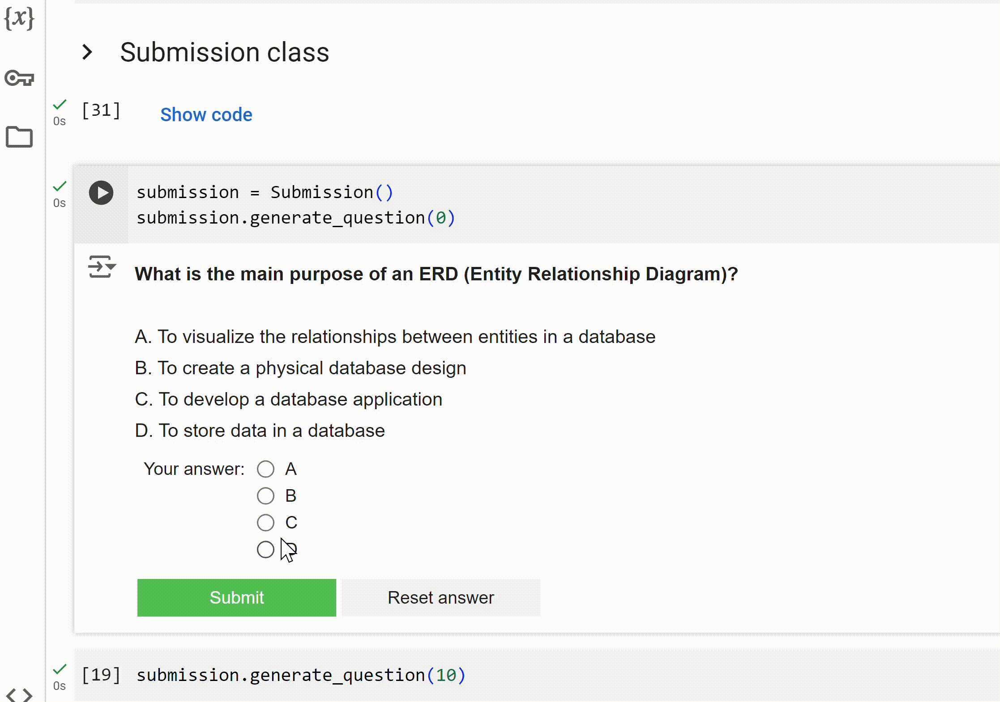

# Coderschool Exam Client

Update (27 Sep 2024): Complete exam notebook for M1.1

## About the project
This document provides a detailed explanation of Coderschool Exam Client, focusing on its design, architecture, functionality, and usage. It is intended for developers and engineers working on or maintaining the project.

Expected output

## Exam notebook
| Module       | Description       | Link                                                                                  |
|--------------|-------------------|---------------------------------------------------------------------------------------|
| M1.1         | Basic SQL         | https://colab.research.google.com/drive/1E3sppN-vjschXS46WTeqZnQSmRBcuggN?usp=sharing |
| M1.2         | Advanced SQL      | Link                                                                                  |
| M2.1         | Python 101        | Link                                                                                  |
| M3.1         | Pandas 101        | Link                                                                                  |
| M4.1         | Data Visualization| Link                                                                                  |